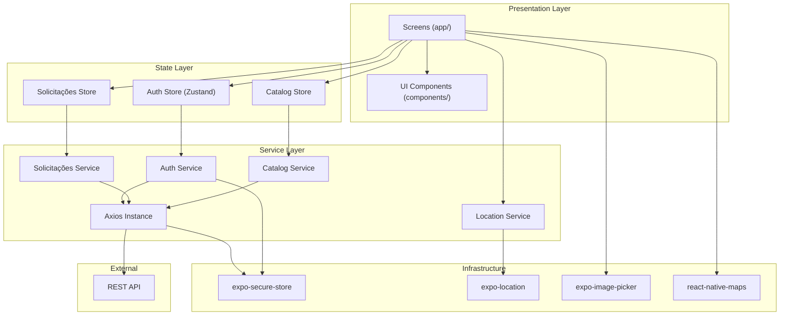
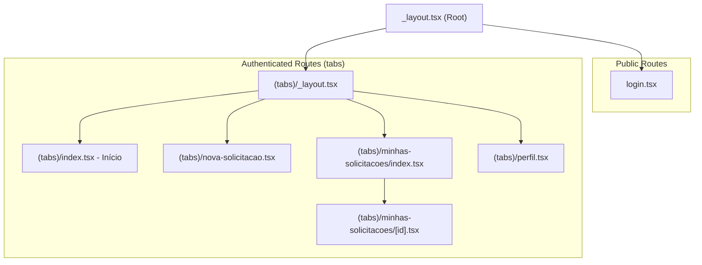
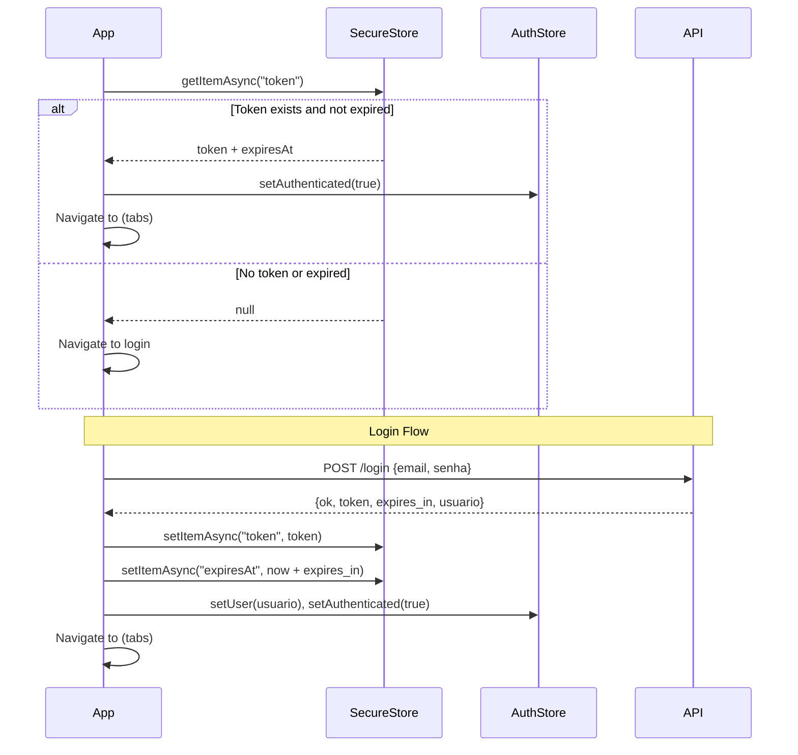
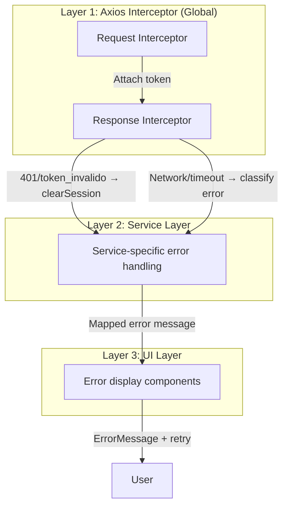

# Design Document: Conecta Boa Esperança Mobile

## Overview

Aplicativo mobile React Native (Expo) com TypeScript que permite cidadãos reportarem problemas urbanos e técnicos atualizarem status/localização. O app consome a API REST existente em `http://cidadeinteligente.online/conecta_boaesperanca/api`.

### Stack Tecnológico

| Camada | Tecnologia | Justificativa |
|--------|-----------|---------------|
| Framework | Expo SDK (managed workflow) | Build simplificado, OTA updates, acesso a APIs nativas |
| Navegação | Expo Router (file-based) | Convenção sobre configuração, deep linking nativo |
| UI | Tamagui 2.4 | Já presente no projeto, design system consistente |
| Linguagem | TypeScript strict | Tipagem estática, refactoring seguro |
| HTTP Client | Axios 1.x | Interceptors para auth/error, cancelamento de requests |
| Estado Global | Zustand | Leve, sem boilerplate, persistência nativa com middleware |
| Armazenamento Seguro | expo-secure-store | Keychain (iOS) / EncryptedSharedPrefs (Android) para JWT |
| Localização | expo-location | API unificada iOS/Android para GPS |
| Câmera/Galeria | expo-image-picker | Captura de fotos e seleção de galeria |
| Mapas | react-native-maps | MapView nativo com markers |

### Decisões Arquiteturais

1. **Zustand sobre Context**: Context causa re-renders em toda a árvore de componentes; Zustand permite subscriptions granulares e middleware de persistência.
2. **Axios sobre fetch**: Interceptors simplificam injeção do token e tratamento centralizado de erros; suporte nativo a timeout e cancelamento.
3. **Expo Router file-based**: Alinha com a convenção moderna do Expo, suporta deep linking automático e typed routes.
4. **Separação de camadas**: API layer (services) → State layer (stores) → UI layer (screens/components).

## Architecture

### Diagrama de Camadas



### Estrutura de Navegação (Expo Router)



### Fluxo de Autenticação



## Components and Interfaces

### API Client (services/api.ts)

```typescript
// Axios instance com interceptors
interface ApiClientConfig {
  baseURL: string;        // http://cidadeinteligente.online/conecta_boaesperanca/api
  timeout: number;        // 30000ms default
}

// Request interceptor: injeta Authorization Bearer
// Response interceptor: trata erros padrão da API
```

### Auth Service (services/auth.ts)

```typescript
interface LoginRequest {
  email: string;
  senha: string;
}

interface LoginResponse {
  ok: true;
  token: string;
  expires_in: number;
  usuario: Usuario;
}

interface AuthService {
  login(credentials: LoginRequest): Promise<LoginResponse>;
  getProfile(): Promise<Usuario>;
  getStoredToken(): Promise<string | null>;
  storeToken(token: string, expiresIn: number): Promise<void>;
  clearToken(): Promise<void>;
  isTokenValid(): Promise<boolean>;
}
```

### Solicitações Service (services/solicitacoes.ts)

```typescript
interface CriarSolicitacaoRequest {
  id_servico: number;
  descricao: string;
  endereco?: string;
  bairro?: string;
  numero?: string;
  latitude?: string;
  longitude?: string;
  prioridade?: Prioridade;
}

interface ListarSolicitacoesParams {
  page?: number;
  per_page?: number;
  status?: StatusSolicitacao;
  data_inicio?: string; // YYYY-MM-DD
  data_fim?: string;    // YYYY-MM-DD
}

interface PaginacaoResponse {
  page: number;
  per_page: number;
  total: number;
  total_pages: number;
}

interface AlterarStatusRequest {
  status: StatusSolicitacao;
  comentario?: string;
}

interface SolicitacoesService {
  listar(params: ListarSolicitacoesParams): Promise<{ dados: Solicitacao[]; paginacao: PaginacaoResponse }>;
  detalhar(id: number): Promise<SolicitacaoDetalhe>;
  criar(data: CriarSolicitacaoRequest, fotos?: ImageFile[]): Promise<{ id_solicitacao: number; fotos: Foto[] }>;
  alterarStatus(id: number, data: AlterarStatusRequest): Promise<void>;
}
```

### Catalog Service (services/catalog.ts)

```typescript
interface CatalogService {
  listarSetores(): Promise<Setor[]>;
  listarServicos(idSetor?: number): Promise<Servico[]>;
}
```

### Location Service (services/location.ts)

```typescript
interface Coordinates {
  latitude: number;
  longitude: number;
}

interface LocationService {
  requestPermission(): Promise<boolean>;
  getCurrentPosition(timeoutMs?: number): Promise<Coordinates | null>;
  registrarLocalizacaoTecnico(idSolicitacao: number, coords: Coordinates): Promise<void>;
}
```

### Auth Store (stores/authStore.ts)

```typescript
interface AuthState {
  user: Usuario | null;
  isAuthenticated: boolean;
  isLoading: boolean;
  login: (email: string, senha: string) => Promise<void>;
  logout: () => Promise<void>;
  checkAuth: () => Promise<void>;
  clearSession: () => Promise<void>;
}
```

### Solicitações Store (stores/solicitacoesStore.ts)

```typescript
interface SolicitacoesState {
  solicitacoes: Solicitacao[];
  paginacao: PaginacaoResponse | null;
  currentFilter: ListarSolicitacoesParams;
  isLoading: boolean;
  error: string | null;
  fetchSolicitacoes: (params?: ListarSolicitacoesParams) => Promise<void>;
  loadNextPage: () => Promise<void>;
  resetList: () => void;
}
```

### UI Components

| Componente | Descrição |
|-----------|-----------|
| `LoadingOverlay` | Spinner fullscreen com fundo semi-transparente |
| `ErrorMessage` | Card de erro com botão retry |
| `SolicitacaoCard` | Item da lista com status badge colorido |
| `PhotoPicker` | Grid de thumbnails com add/remove (max 5) |
| `MapPreview` | MapView compacto com marker |
| `StatusBadge` | Badge colorido por status |
| `PrioritySelector` | Select com as 4 opções de prioridade |
| `StatusSelector` | Select com os 6 status possíveis (técnico) |

## Data Models

### Tipos Base

```typescript
type TipoUsuario = 'admin' | 'setor' | 'tecnico' | 'cidadao' | 'entrevistador';
type Prioridade = 'baixa' | 'media' | 'alta' | 'critica';
type StatusSolicitacao = 'aberto' | 'em_analise' | 'em_andamento' | 'resolvido' | 'fechado' | 'cancelado';
```

### Usuario

```typescript
interface Usuario {
  id: number;
  nome: string;
  email: string;
  tipo: TipoUsuario;
  id_setor: number | null;
  imagem: string | null;
}
```

### Setor

```typescript
interface Setor {
  id_setor: number;
  nome: string;
  sigla: string;
  total_servicos: number;
}
```

### Servico

```typescript
interface Servico {
  id_servico: number;
  id_setor: number;
  nome: string;
  nome_setor: string;
  sigla?: string;
}
```

### Solicitacao (listagem)

```typescript
interface Solicitacao {
  id_solicitacao: number;
  id_usuario: number;
  id_servico: number;
  descricao: string;
  status: StatusSolicitacao;
  status_nome: string;
  nome_servico: string;
  criado_em: string; // "YYYY-MM-DD HH:mm:ss"
}
```

### SolicitacaoDetalhe

```typescript
interface SolicitacaoDetalhe {
  id_solicitacao: number;
  id_usuario: number;
  id_servico: number;
  nome_servico: string;
  id_setor: number;
  descricao: string;
  status: StatusSolicitacao;
  fotos: Foto[];
  localizacao_tecnico: LocalizacaoTecnico | null;
}
```

### Foto

```typescript
interface Foto {
  id_foto: number;
  caminho: string;
  url: string;
  tipo: string;
  metadata: {
    original_name: string;
    size: number;
    mime: string;
    upload_date: string;
    source: string;
  };
}
```

### LocalizacaoTecnico

```typescript
interface LocalizacaoTecnico {
  latitude: string;
  longitude: string;
}
```

### ImageFile (para upload)

```typescript
interface ImageFile {
  uri: string;
  name: string;
  type: string; // mime type
  size: number; // bytes
}
```

### API Error Response

```typescript
interface ApiErrorResponse {
  ok: false;
  erro: string;
  detalhes?: string[];
}
```

### Mapa de Erros para Mensagens pt-BR

```typescript
const ERROR_MESSAGES: Record<string, string> = {
  email_e_senha_obrigatorios: 'E-mail e senha são obrigatórios',
  email_ou_senha_invalidos: 'E-mail ou senha inválidos',
  email_nao_confirmado: 'E-mail não confirmado. Verifique sua caixa de entrada',
  token_invalido: 'Sessão expirada. Faça login novamente',
  usuario_nao_encontrado: 'Usuário não encontrado',
  id_servico_e_descricao_obrigatorios: 'Serviço e descrição são obrigatórios',
  prioridade_invalida: 'Prioridade selecionada é inválida',
  fotos_invalidas: 'Fotos inválidas',
  acesso_negado: 'Você não tem permissão para esta ação',
  status_invalido: 'Status selecionado é inválido',
  solicitacao_nao_encontrada: 'Solicitação não encontrada',
  apenas_tecnico: 'Apenas técnicos podem compartilhar localização',
  dados_obrigatorios: 'Dados de localização são obrigatórios',
};

const NETWORK_ERROR_MESSAGES = {
  offline: 'Sem conexão com a internet. Verifique sua rede e tente novamente',
  timeout: 'O servidor não respondeu. Tente novamente em alguns instantes',
  unexpected: 'Ocorreu um erro inesperado. Tente novamente',
};
```

## Correctness Properties

*A property is a characteristic or behavior that should hold true across all valid executions of a system—essentially, a formal statement about what the system should do. Properties serve as the bridge between human-readable specifications and machine-verifiable correctness guarantees.*

### Property 1: Token injection in requests

*For any* HTTP request to a protected endpoint, if a valid (non-expired) token exists in Secure Storage, the outgoing request SHALL contain an `Authorization: Bearer <token>` header with that exact token value.

**Validates: Requirements 1.6**

### Property 2: Solicitação form required field validation

*For any* form submission attempt where `id_servico` is missing/zero OR `descricao` is empty/whitespace-only, the validation function SHALL reject the submission and return an error indicating which fields are required.

**Validates: Requirements 6.1**

### Property 3: Default prioridade assignment

*For any* valid Solicitação form data where prioridade is not explicitly set (undefined or null), the request payload sent to the API SHALL contain `prioridade: "media"`.

**Validates: Requirements 6.3**

### Property 4: Prioridade value restriction

*For any* string value, the prioridade validator SHALL accept it if and only if it equals one of: "baixa", "media", "alta", "critica". All other values SHALL be rejected.

**Validates: Requirements 6.4**

### Property 5: Photo attachment validation

*For any* set of photo files to be attached: (a) if the count exceeds 5, the set SHALL be rejected; (b) for each individual photo, if its size exceeds 2,097,152 bytes (2 MB) it SHALL be rejected; (c) for each individual photo, if its file extension is not in {jpg, jpeg, png, gif, bmp, webp} it SHALL be rejected. Valid photos (count ≤ 5, size ≤ 2MB, allowed extension) SHALL be accepted.

**Validates: Requirements 6.5, 6.6, 6.7**

### Property 6: Coordinate formatting precision

*For any* floating-point latitude or longitude value, when formatted for the Solicitação form (citizen GPS capture), the resulting string SHALL contain at most 6 decimal places. When formatted for the technician location sharing endpoint, the resulting string SHALL contain at most 8 decimal places.

**Validates: Requirements 7.2, 11.2**

### Property 7: Description truncation

*For any* Solicitação description string, when displayed in the list view: if the string length exceeds 100 characters, the displayed text SHALL be exactly 100 characters followed by an ellipsis indicator; if the string length is ≤ 100 characters, it SHALL be displayed in full without modification.

**Validates: Requirements 8.2**

### Property 8: Date formatting for display

*For any* valid date string in "YYYY-MM-DD HH:mm:ss" format, the display formatter SHALL produce a string in "DD/MM/YYYY HH:mm" format preserving the same day, month, year, hour, and minute values.

**Validates: Requirements 8.2**

### Property 9: Pagination boundary enforcement

*For any* pagination state where the current `page` is less than `total_pages`, requesting the next page SHALL increment page by 1 and append results. When `page` equals `total_pages`, no additional page request SHALL be triggered.

**Validates: Requirements 8.3**

### Property 10: Filter application resets pagination

*For any* filter change (status selection, date range modification), the resulting API request SHALL have `page` set to 1, regardless of the previous page value.

**Validates: Requirements 8.4, 8.5**

### Property 11: Técnico-only UI controls visibility

*For any* authenticated user, the status update control and "Compartilhar Localização" button SHALL be visible if and only if the user's `tipo` equals "tecnico". For all other `tipo` values, these controls SHALL be hidden.

**Validates: Requirements 10.1, 11.1**

### Property 12: Comentário length enforcement

*For any* string input in the comentário field, the system SHALL accept it if its length is ≤ 500 characters and SHALL prevent submission or truncate if it exceeds 500 characters.

**Validates: Requirements 10.3**

### Property 13: Network error classification

*For any* failed HTTP request: (a) if the failure is due to no internet connectivity, the displayed message SHALL be "Sem conexão com a internet. Verifique sua rede e tente novamente"; (b) if the failure is due to timeout (server not responding within the configured limit), the displayed message SHALL be "O servidor não respondeu. Tente novamente em alguns instantes"; (c) if the response does not contain a structured JSON body with `ok` and `erro` fields, the displayed message SHALL be "Ocorreu um erro inesperado. Tente novamente".

**Validates: Requirements 13.1, 13.2, 13.3**

### Property 14: Auth guard enforcement

*For any* application state where no valid Token_JWT exists in Secure Storage (either absent or expired based on stored `expiresAt`), the routing system SHALL restrict access to only the login screen and SHALL not allow navigation to any authenticated route.

**Validates: Requirements 12.1**

### Property 15: Form data preservation on network failure

*For any* form state (new Solicitação, status change) and any network error occurring during submission, all user-entered field values SHALL remain unchanged in the form after the error is displayed.

**Validates: Requirements 6.15, 10.9, 13.5**


## Error Handling

### Estratégia de Tratamento de Erros em Camadas



### Axios Response Interceptor

O interceptor de resposta é o ponto central de tratamento de erros:

```typescript
// Pseudocódigo do interceptor
axiosInstance.interceptors.response.use(
  (response) => response,
  (error) => {
    if (!error.response) {
      // Sem resposta do servidor
      if (error.code === 'ECONNABORTED') {
        throw new AppError('timeout', NETWORK_ERROR_MESSAGES.timeout);
      }
      throw new AppError('offline', NETWORK_ERROR_MESSAGES.offline);
    }

    const data = error.response.data;

    // Erros de autenticação → limpar sessão
    if (data?.erro === 'token_invalido' || data?.erro === 'usuario_nao_encontrado') {
      authStore.clearSession();
      router.replace('/login');
      throw new AppError('auth', 'Sessão expirada');
    }

    // Erro estruturado da API
    if (data?.ok === false && data?.erro) {
      const message = ERROR_MESSAGES[data.erro] || NETWORK_ERROR_MESSAGES.unexpected;
      throw new AppError('api', message, data.detalhes);
    }

    // Erro não estruturado
    throw new AppError('unexpected', NETWORK_ERROR_MESSAGES.unexpected);
  }
);
```

### Classes de Erro

```typescript
type ErrorType = 'offline' | 'timeout' | 'auth' | 'api' | 'unexpected' | 'validation';

class AppError extends Error {
  constructor(
    public type: ErrorType,
    message: string,
    public details?: string[]
  ) {
    super(message);
  }
}
```

### Validação Client-Side

Validações executadas antes de enviar a request:

| Campo | Regra | Mensagem |
|-------|-------|----------|
| email | Não vazio, formato email | "E-mail é obrigatório" / "Formato de e-mail inválido" |
| senha | Não vazio | "Senha é obrigatória" |
| id_servico | > 0 | "Selecione um serviço" |
| descricao | Não vazio/whitespace | "Descrição é obrigatória" |
| prioridade | ∈ {baixa, media, alta, critica} | "Prioridade inválida" |
| fotos[].size | ≤ 2MB | "Foto excede o tamanho máximo de 2 MB" |
| fotos[].ext | ∈ {jpg,jpeg,png,gif,bmp,webp} | "Formato não suportado: {ext}" |
| fotos.length | ≤ 5 | "Máximo de 5 fotos permitido" |
| comentario | ≤ 500 chars | "Comentário excede 500 caracteres" |

### Timeouts por Endpoint

| Operação | Timeout | Justificativa |
|----------|---------|---------------|
| Login | 15s | Operação simples, feedback rápido |
| GET /me | 10s | Consulta única, leve |
| GET /setores, /servicos | 15s | Consultas de catálogo |
| GET /solicitacoes (lista) | 15s | Paginada, volume controlado |
| GET /solicitacoes/{id} | 15s | Consulta única |
| POST /solicitacoes (sem foto) | 30s | Criação com validações |
| POST /solicitacoes (com foto) | 60s | Upload de até 5 fotos × 2MB |
| POST /solicitacoes/{id}/status | 30s | Alteração com histórico |
| POST /tecnico/localizacao | 15s | Payload leve |

### Retry Strategy

- **Retry automático**: Não implementado (evita requests duplicados em POST)
- **Retry manual**: Botão de retry em todas as telas com erro, re-executa a última request com os mesmos parâmetros
- **Preservação de dados**: Em formulários, todos os campos permanecem preenchidos após erro de rede

## Testing Strategy

### Abordagem Dual: Unit Tests + Property-Based Tests

O projeto adota uma estratégia de testes complementar:

- **Property-Based Tests (PBT)**: Verificam propriedades universais que devem valer para todas as entradas válidas. Usam a biblioteca [fast-check](https://github.com/dubzzz/fast-check) com TypeScript.
- **Unit Tests (example-based)**: Verificam cenários específicos, edge cases e integrações mockadas.
- **Integration Tests**: Verificam fluxos completos com mocks de API.

### Configuração PBT

- **Biblioteca**: fast-check 3.x
- **Framework de testes**: Jest (compatível com Expo)
- **Iterações mínimas**: 100 por property test
- **Tag format**: `Feature: conecta-boa-esperanca-mobile, Property {N}: {description}`

### Mapeamento de Properties para Módulos de Teste

| Property | Módulo testado | Arquivo de teste |
|----------|---------------|------------------|
| 1: Token injection | `services/api.ts` (interceptor) | `__tests__/services/api.test.ts` |
| 2: Required field validation | `utils/validation.ts` | `__tests__/utils/validation.test.ts` |
| 3: Default prioridade | `services/solicitacoes.ts` | `__tests__/services/solicitacoes.test.ts` |
| 4: Prioridade restriction | `utils/validation.ts` | `__tests__/utils/validation.test.ts` |
| 5: Photo validation | `utils/validation.ts` | `__tests__/utils/validation.test.ts` |
| 6: Coordinate formatting | `utils/formatters.ts` | `__tests__/utils/formatters.test.ts` |
| 7: Description truncation | `utils/formatters.ts` | `__tests__/utils/formatters.test.ts` |
| 8: Date formatting | `utils/formatters.ts` | `__tests__/utils/formatters.test.ts` |
| 9: Pagination boundary | `stores/solicitacoesStore.ts` | `__tests__/stores/solicitacoesStore.test.ts` |
| 10: Filter resets page | `stores/solicitacoesStore.ts` | `__tests__/stores/solicitacoesStore.test.ts` |
| 11: Técnico UI visibility | `components/TecnicoControls.tsx` | `__tests__/components/TecnicoControls.test.ts` |
| 12: Comentário length | `utils/validation.ts` | `__tests__/utils/validation.test.ts` |
| 13: Network error classification | `services/api.ts` (interceptor) | `__tests__/services/api.test.ts` |
| 14: Auth guard | `app/_layout.tsx` / auth store | `__tests__/stores/authStore.test.ts` |
| 15: Form data preservation | Store layer | `__tests__/stores/formStore.test.ts` |

### Unit Tests (Example-Based)

Cenários que não são cobertos por PBT:

- Login flow com mock de API (success + each error code)
- Logout clears state and navigates
- Empty state messages ("Nenhum setor disponível", etc.)
- Photo thumbnail rendering (max 5)
- Map marker rendering with coordinates
- Navigation stack reset on logout
- Loading indicator visibility during requests

### Generators (fast-check)

Generators customizados para os property tests:

```typescript
// Generators planejados
const arbUsuario: fc.Arbitrary<Usuario>
const arbSolicitacao: fc.Arbitrary<Solicitacao>
const arbSetor: fc.Arbitrary<Setor>
const arbServico: fc.Arbitrary<Servico>
const arbImageFile: fc.Arbitrary<ImageFile>  // com size e extension variáveis
const arbCoordinate: fc.Arbitrary<number>    // -90 a 90 lat, -180 a 180 lng
const arbPrioridade: fc.Arbitrary<string>    // mix de válidos e inválidos
const arbDateString: fc.Arbitrary<string>    // formato YYYY-MM-DD HH:mm:ss
const arbPaginacao: fc.Arbitrary<PaginacaoResponse>
const arbNetworkError: fc.Arbitrary<AxiosError>  // tipos: offline, timeout, unstructured
```

### Cobertura Esperada

| Área | Tipo de teste | Cobertura alvo |
|------|--------------|----------------|
| Validation utils | PBT | 100% das funções de validação |
| Formatters | PBT | 100% das funções de formatação |
| API interceptors | PBT + Unit | Error classification e token injection |
| Stores (logic) | PBT + Unit | Pagination, filters, auth guard |
| Screens (render) | Unit/Integration | Renderização condicional, empty states |
| Navigation | Integration | Auth flow, tab structure |
