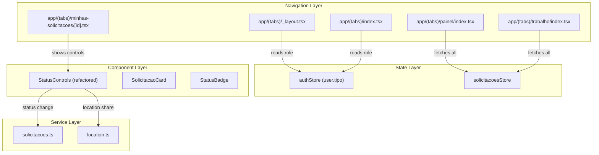

# Design Document: Role-Based Features

## Overview

This design extends the Conecta Sorriso mobile app with role-specific functionality for **admin** and **técnico** users. Currently the app only supports the cidadão flow. This extension introduces:

- A dynamic home screen that adapts quick action cards per user role
- Role-aware tab navigation that shows/hides tabs and the center "+" button
- An Admin Dashboard with aggregated status counts and full solicitações management
- A Técnico Work View with work queue, status filtering, and highlighted active items
- A unified StatusControls component that works for both admin and técnico roles
- Pagination and filtering improvements for elevated roles viewing all solicitações

**Key technical constraints:**
- Use React Native primitives (View, Text, StyleSheet, TouchableOpacity) — NOT Tamagui YStack/XStack for new screens
- Keep Feather icons from @expo/vector-icons
- Use existing Zustand store patterns
- NO react-native-reanimated (crashes in Expo Go)
- NO Tamagui pressStyle or onPress on YStack/XStack (unreliable)
- SafeAreaView from react-native-safe-area-context

## Architecture

The feature follows the existing architecture: Expo Router file-based navigation + Zustand stores + Axios service layer.



**Design Decisions:**

1. **Pure utility functions for role logic**: Extract `getTabsForRole()`, `getHomeQuickActions()`, `shouldHighlight()`, and `truncateDescription()` as pure functions in a new `src/utils/roles.ts` file. This enables testability without rendering components.

2. **Refactored StatusControls**: The existing TecnicoControls component uses Tamagui (YStack, Button, TextArea). It needs refactoring to use React Native primitives and accepting a `showLocationButton` prop to control location sharing visibility (admin doesn't get location, técnico does).

3. **New tab routes**: Admin gets `app/(tabs)/painel/` nested route. Técnico gets `app/(tabs)/trabalho/` nested route. Both use `href: null` conditionally in _layout to show/hide based on role.

4. **Existing store reuse**: The `solicitacoesStore` already supports `fetchSolicitacoes`, `loadNextPage`, `applyFilter`, and `resetList`. Admin and Técnico screens can use the same store — the API already returns all solicitações for elevated roles based on the auth token.

## Components and Interfaces

### New Utility Module: `src/utils/roles.ts`

```typescript
import type { TipoUsuario } from '@/types';

interface QuickAction {
  title: string;
  subtitle: string;
  icon: string;
  route: string;
  bgColor: string;
  iconBgColor: string;
  textColor: string;
}

interface TabConfig {
  name: string;
  title: string;
  icon: string;
  visible: boolean;
  isCenterButton: boolean;
}

/**
 * Returns the quick action cards for the home screen based on user role.
 */
export function getHomeQuickActions(role: TipoUsuario): QuickAction[];

/**
 * Returns the complete tab configuration based on user role.
 * Always includes "Início" and "Perfil".
 */
export function getTabsForRole(role: TipoUsuario): TabConfig[];

/**
 * Determines if the StatusControls component should render.
 */
export function shouldShowStatusControls(role: TipoUsuario): boolean;

/**
 * Determines if the location sharing button should appear.
 * Only true for técnico role.
 */
export function shouldShowLocationButton(role: TipoUsuario): boolean;

/**
 * Determines if a solicitação should be visually highlighted.
 * True when status is "em_andamento".
 */
export function shouldHighlight(status: StatusSolicitacao): boolean;

/**
 * Truncates a description to maxLength characters, appending "..." if truncated.
 */
export function truncateDescription(description: string, maxLength?: number): string;

/**
 * Computes status counts from a list of solicitações.
 */
export function computeStatusCounts(
  solicitacoes: Solicitacao[]
): Record<StatusSolicitacao, number>;

/**
 * Filters solicitações by status. Returns all if status is undefined.
 */
export function filterByStatus(
  solicitacoes: Solicitacao[],
  status?: StatusSolicitacao
): Solicitacao[];

/**
 * Clamps per_page to the API maximum of 50.
 */
export function clampPerPage(perPage: number): number;
```

### Refactored Component: `src/components/StatusControls.tsx`

```typescript
interface StatusControlsProps {
  idSolicitacao: number;
  currentStatus: StatusSolicitacao;
  onStatusChanged: () => void;
  showLocationButton: boolean; // true for técnico, false for admin
}
```

The refactored component:
- Uses React Native View, Text, StyleSheet, TouchableOpacity, TextInput
- Accepts `showLocationButton` prop to conditionally render the GPS button
- Checks `user.tipo` internally — only renders for admin/tecnico
- Handles status change API calls and error mapping
- Handles location sharing flow (permission → capture → POST)

### Modified: `app/(tabs)/_layout.tsx`

- Reads `user.tipo` from `useAuthStore`
- Conditionally renders tabs using `getTabsForRole(user.tipo)`
- Admin: shows "Painel" tab (bar-chart-2 icon), hides center "+" button
- Técnico: shows "Trabalho" tab (tool icon), keeps center "+" button
- Cidadão: no changes to existing tabs

### New Screen: `app/(tabs)/painel/index.tsx`

Admin Dashboard:
- Status summary cards showing counts per status (using `computeStatusCounts`)
- Tappable cards that filter the list below
- FlatList with pagination, pull-to-refresh
- Uses `SolicitacaoCard` for list items with truncated description
- Error state with retry button

### New Screen: `app/(tabs)/trabalho/index.tsx`

Técnico Work View:
- Filter bar with status chips (same pattern as minhas-solicitacoes)
- FlatList with pagination, pull-to-refresh
- Items with `status === "em_andamento"` get a distinct left border (amber/orange)
- Uses `SolicitacaoCard` for list items
- Error state with retry button

### Modified: `app/(tabs)/minhas-solicitacoes/[id].tsx`

- Replaces the current `user?.tipo === 'tecnico'` check with `shouldShowStatusControls(user?.tipo)`
- Passes `showLocationButton={shouldShowLocationButton(user?.tipo)}` to StatusControls

## Data Models

No new data models are introduced. The feature reuses existing types:

```typescript
// Already defined in src/types/index.ts
type TipoUsuario = 'admin' | 'setor' | 'tecnico' | 'cidadao' | 'entrevistador';
type StatusSolicitacao = 'aberto' | 'em_analise' | 'em_andamento' | 'resolvido' | 'fechado' | 'cancelado';

interface Solicitacao {
  id_solicitacao: number;
  id_usuario: number;
  id_servico: number;
  descricao: string;
  status: StatusSolicitacao;
  status_nome: string;
  nome_servico: string;
  criado_em: string;
}

interface ListarSolicitacoesParams {
  page?: number;
  per_page?: number;     // max 50
  status?: StatusSolicitacao;
  data_inicio?: string;
  data_fim?: string;
}

interface PaginacaoResponse {
  page: number;
  per_page: number;
  total: number;
  total_pages: number;
}
```

**New internal types** (in `src/utils/roles.ts`):

```typescript
interface QuickAction {
  title: string;
  subtitle: string;
  icon: string;       // Feather icon name
  route: string;      // Expo Router path
  bgColor: string;    // card background color
  iconBgColor: string; // icon circle color
  textColor: string;  // text accent color
}

interface TabConfig {
  name: string;        // route file name
  title: string;       // tab label
  icon: string;        // Feather icon name
  visible: boolean;    // whether to show in tab bar
  isCenterButton: boolean; // whether to use raised center style
}
```

## Correctness Properties

*A property is a characteristic or behavior that should hold true across all valid executions of a system — essentially, a formal statement about what the system should do. Properties serve as the bridge between human-readable specifications and machine-verifiable correctness guarantees.*

### Property 1: Role determines home quick actions

*For any* valid user role (admin, tecnico, cidadao), `getHomeQuickActions(role)` SHALL return exactly 2 quick action cards whose titles match the defined mapping for that role, and the returned cards for different roles SHALL never overlap.

**Validates: Requirements 1.1, 1.2, 1.3**

### Property 2: Role determines tab configuration with common tabs preserved

*For any* valid user role, `getTabsForRole(role)` SHALL always include tabs named "Início" and "Perfil" as visible, and SHALL include the "Nova Solicitação" center button as visible if and only if the role is NOT "admin". Admin gets a "Painel" tab visible, técnico gets a "Trabalho" tab visible.

**Validates: Requirements 2.1, 2.2, 2.3, 2.4, 2.5, 2.6**

### Property 3: Status filtering returns only matching items

*For any* list of solicitações and any selected StatusSolicitacao value, `filterByStatus(list, status)` SHALL return a list where every item has that exact status, and the returned list SHALL be a subset of the original list.

**Validates: Requirements 3.3, 4.2**

### Property 4: Description truncation respects maximum length

*For any* string, `truncateDescription(str, 80)` SHALL return a string of at most 80 characters. If the original string exceeds 80 characters, the result SHALL end with "..." and have length exactly 80.

**Validates: Requirements 3.4, 4.3**

### Property 5: em_andamento highlighting

*For any* StatusSolicitacao value, `shouldHighlight(status)` SHALL return true if and only if the status equals "em_andamento".

**Validates: Requirements 4.5**

### Property 6: StatusControls visibility by role

*For any* valid TipoUsuario, `shouldShowStatusControls(role)` SHALL return true if and only if the role is "admin" or "tecnico".

**Validates: Requirements 5.1, 7.4, 7.5**

### Property 7: Location button visibility

*For any* valid TipoUsuario, `shouldShowLocationButton(role)` SHALL return true if and only if the role is "tecnico".

**Validates: Requirements 6.1, 7.1, 7.2, 7.3**

### Property 8: Comment validation rejects strings exceeding 500 characters

*For any* string with length greater than 500, `validateComentario(str)` SHALL return `{ valid: false }`. For any string with length ≤ 500, it SHALL return `{ valid: true }`.

**Validates: Requirements 5.3**

### Property 9: per_page clamped to maximum 50

*For any* positive integer value for per_page, `clampPerPage(value)` SHALL return `min(value, 50)`.

**Validates: Requirements 8.2**

### Property 10: Pagination append preserves existing items

*For any* existing solicitações list and any new page of results, after `loadNextPage` completes successfully, the resulting list SHALL equal the concatenation of the previous list with the new page items, preserving order.

**Validates: Requirements 8.3**

### Property 11: Filter change resets page to 1

*For any* current pagination state with page > 1 and any filter change, after `applyFilter` the resulting state SHALL have page equal to 1 and the list SHALL be replaced (not appended to the previous list).

**Validates: Requirements 8.5**

### Property 12: No additional loading when on last page

*For any* pagination state where `page >= total_pages`, calling `loadNextPage` SHALL NOT trigger an API request and SHALL leave the list unchanged.

**Validates: Requirements 8.6**

## Error Handling

### Status Change Errors (StatusControls)

| API Error Code | User-Facing Message | Behavior |
|---|---|---|
| `acesso_negado` | "Acesso negado" | Display error inline, preserve form state |
| `status_invalido` | "Status inválido" | Display error inline, preserve form state |
| `solicitacao_nao_encontrada` | "Solicitação não encontrada" | Display error, navigate back after 3s |
| Network error | "Ocorreu um erro inesperado. Tente novamente" | Display error inline |

### Location Sharing Errors (StatusControls)

| Condition | User-Facing Message | Behavior |
|---|---|---|
| GPS permission denied | "Acesso à localização é necessário" | Display error inline |
| `apenas_tecnico` | "Apenas técnicos podem registrar localização" | Display error inline |
| `dados_obrigatorios` | "Dados obrigatórios não informados" | Display error inline |
| Network/unexpected | "Não foi possível compartilhar a localização. Tente novamente" | Display error inline |

### Data Fetching Errors (Dashboard / Work View)

| Condition | Behavior |
|---|---|
| API request fails | Show `ErrorMessage` component with retry button |
| Pull-to-refresh fails | Show error inline above the list |

All error messages use the existing `AppError` class and `ERROR_MESSAGES` mapping from `src/utils/errors.ts`.

## Testing Strategy

### Property-Based Tests (fast-check)

The project will use **fast-check** as the property-based testing library (TypeScript/JavaScript ecosystem standard).

Each property test runs a minimum of **100 iterations** with randomly generated inputs.

Property tests target the pure utility functions in `src/utils/roles.ts` and the existing `validateComentario` in `src/utils/validation.ts`:

- `getHomeQuickActions` — validates Property 1
- `getTabsForRole` — validates Property 2
- `filterByStatus` — validates Property 3
- `truncateDescription` — validates Property 4
- `shouldHighlight` — validates Property 5
- `shouldShowStatusControls` — validates Property 6
- `shouldShowLocationButton` — validates Property 7
- `validateComentario` — validates Property 8
- `clampPerPage` — validates Property 9
- Store pagination/filter behavior — validates Properties 10, 11, 12

Tag format: `Feature: role-based-features, Property {N}: {title}`

### Unit Tests (example-based)

- Navigation behavior when quick action cards are tapped
- StatusControls renders correctly for admin (no location button)
- StatusControls renders correctly for técnico (with location button)
- StatusControls does not render for cidadão
- Error messages display correctly for each API error code
- Success messages auto-dismiss after 3 seconds
- Admin Dashboard shows all 6 status count cards
- Pull-to-refresh triggers re-fetch

### Integration Tests

- API calls include correct parameters for elevated roles
- Status change POST sends correct payload
- Location POST sends correct coordinates
- Auth token is included in all protected requests

### Snapshot / Smoke Tests

- StatusControls uses TouchableOpacity (not Tamagui pressable)
- New screens use React Native primitives (View, Text, StyleSheet)
- Tab layout correctly configured for each role
